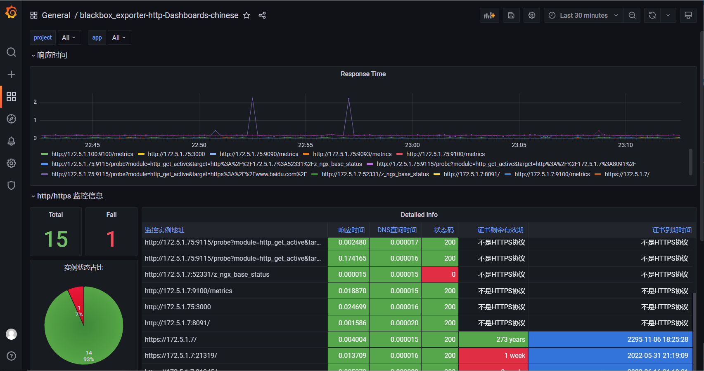
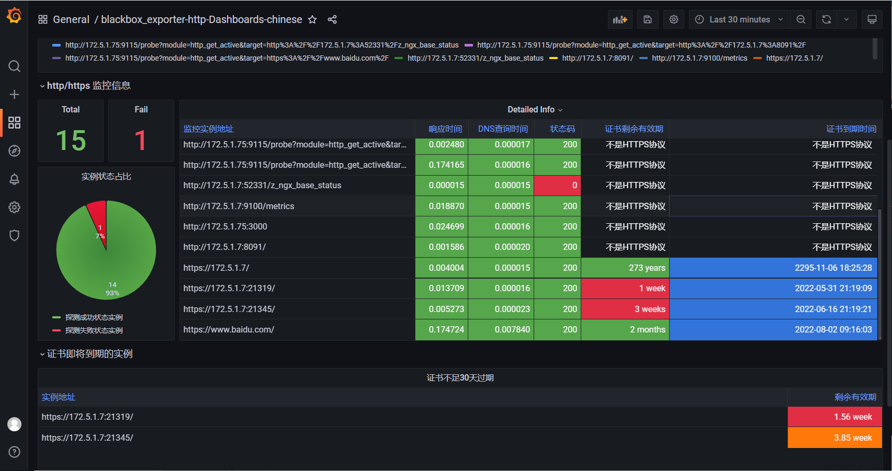
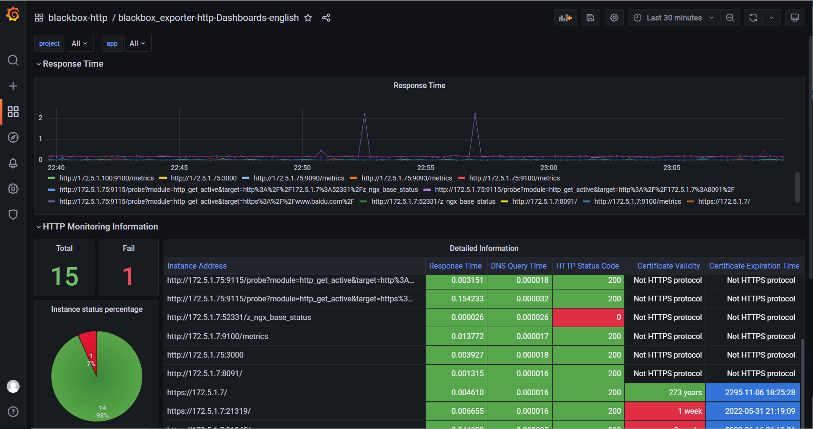

# blackbox_exporter 黑盒 http 探针监控面板

## grafana 官方站点仪表板地址

- 中文版 : https://grafana.com/grafana/dashboards/16292
- English version : [https://grafana.com/grafana/dashboards/16293](https://grafana.com/grafana/dashboards/16293)

**仪表板 ID :** `16292`、`16293`

## 选择器说明
- project : 对应 target 的 project 标签
- app : 对应 target 的 app 标签

## v2 更新概要

- 新增证书剩余不足 30 天实例单独列出表格
- 增加非 https 协议的实例单元格配色

# 界面预览

## 中文面板

## English panel

