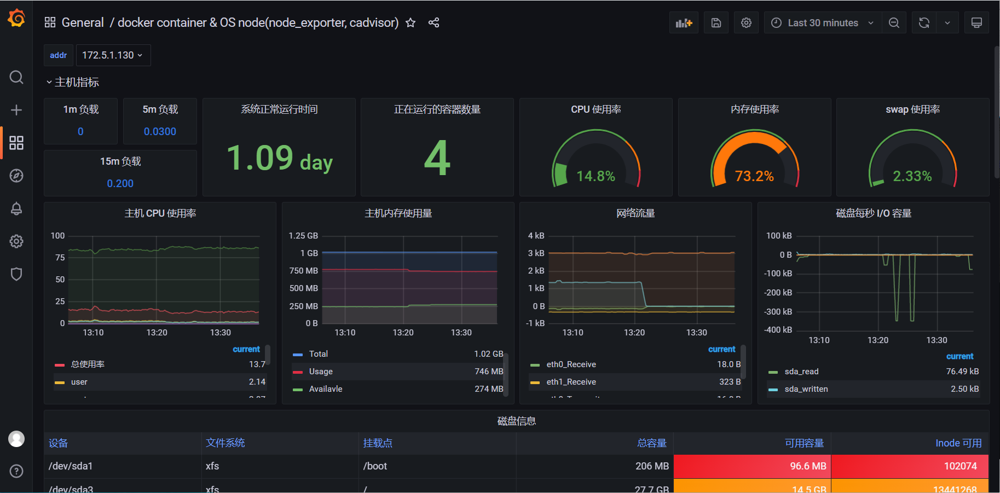
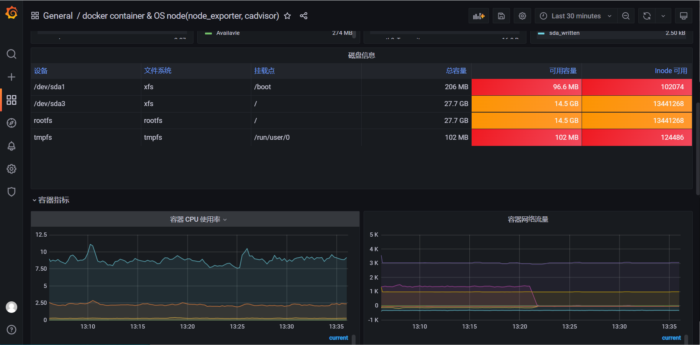
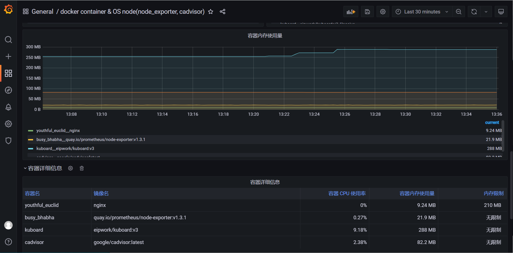

# 容器和节点监控面板(node_exporter, cadvisor)

## grafana 官方站点仪表板地址

- 中文版 : https://grafana.com/grafana/dashboards/16314

**仪表板 ID :** `16314`

## 选择器说明

选择器 addr 通过 addr 标签选择监控主机，可以在 node_exporter job 和 cadvisor job 使用相同的标签重写规则来确保 addr 匹配

```shell
  - job_name: 'docker-metrics'
    static_configs:
      - targets: 
        - '172.5.1.130:8080'
    relabel_configs:
      - source_labels: [__address__]
        target_label: addr
        regex: (.*):(.*)
        replacement: $1

  - job_name: 'node_exporter-static'
    static_configs:
      - targets:
        - '172.5.1.130:9100'
        labels:
          server: kuboard-01
    relabel_configs:
      - source_labels: [__address__]
        target_label: addr
        regex: (.*):(.*)
        replacement: $1
```

# 界面预览






